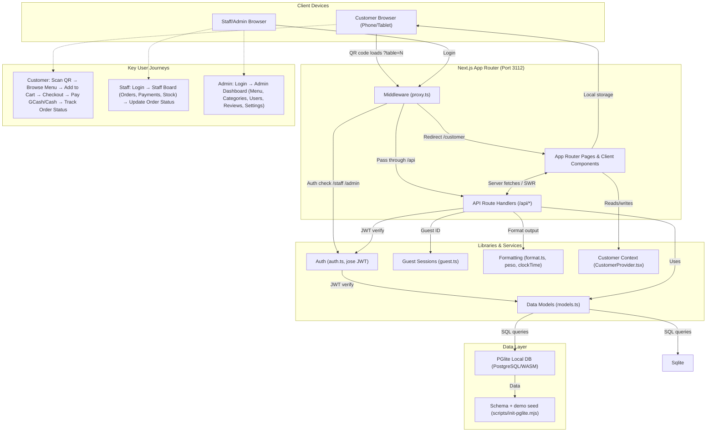

```mermaid
graph TD
    subgraph "Client Devices"
        Browser["Customer Browser (Phone/Tablet)"]
        StaffBrowser["Staff/Admin Browser"]
    end

    subgraph "Next.js App Router (Port 3112)"
        Middleware["Middleware (proxy.ts)"]
        Pages["App Router Pages & Client Components"]
        API["API Route Handlers (/api/*)"]
    end

    subgraph "Libraries & Services"
        Auth["Auth (auth.ts, jose JWT)"]
        Models["Data Models (models.ts)"]
        Guest["Guest Sessions (guest.ts)"]
        Format["Formatting (format.ts, peso, clockTime)"]
        Cart["Customer Context (CustomerProvider.tsx)"]
    end

    subgraph "Data Layer"
        PGlite["PGlite Local DB (PostgreSQL/WASM)"]
        Schema["Schema + demo seed (scripts/init-pglite.mjs)"]
    end

    Browser -->|QR code loads ?table=N| Middleware
    StaffBrowser -->|Login| Middleware

    Middleware -->|Redirect /customer| Pages
    Middleware -->|Auth check /staff /admin| Auth
    Middleware -->|Pass through /api| API
    Auth -->|JWT verify| Models
    Models -->|SQL queries| PGlite
    PGlite -->|Data| Schema

    Pages <-->|Server fetches / SWR| API
    Pages -->|Reads/writes| Cart
    Pages -->|Local storage| Browser
    API -->|Uses| Models
    Models -->|SQL queries| Sqlite
    API -->|Guest ID| Guest
    API -->|JWT verify| Auth
    API -->|Format output| Format

    subgraph "Key User Journeys"
        Flow1["Customer: Scan QR → Browse Menu → Add to Cart → Checkout → Pay GCash/Cash → Track Order Status"]
        Flow2["Staff: Login → Staff Board (Orders, Payments, Stock) → Update Order Status"]
        Flow3["Admin: Login → Admin Dashboard (Menu, Categories, Users, Reviews, Settings)"]
    end

    Browser -.-> Flow1
    StaffBrowser -.-> Flow2
    StaffBrowser -.-> Flow3
```